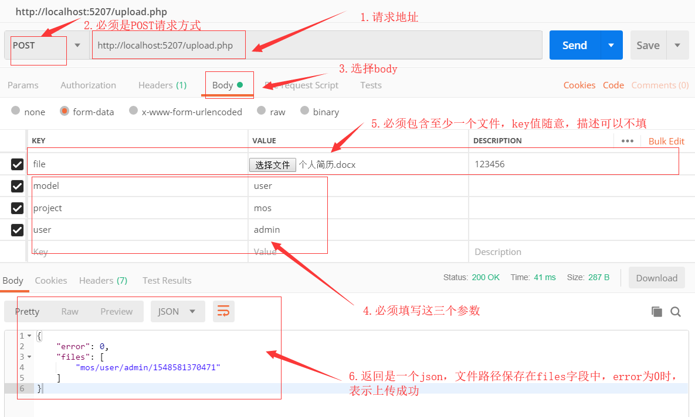
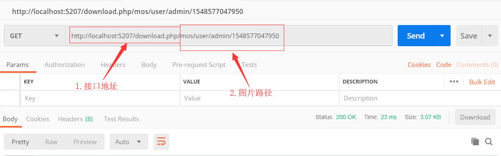

# MoFiles
轻量级PHP文件上传、下载；Lightweight PHP file upload and download

# 使用
1. 搭建PHP环境
2. 将DocumentRoot设置成项目的public目录
3. 设置项目根目录读写权限（最好只将info和files目录设置成可读写，其他目录不能写）
4. 重启服务器

# config.php
config.php 记录了文件信息保存目录和文件保存目录，可以自行更改。
```
// 文件配置（记录信息）目录
const CONFIG_DIR = __DIR__ . '/info/';
// 文件保存目录
const FILES_DIR = __DIR__ . '/files/';
```

# upload.php
上传文件接口，可以上传多个文件，POST请求方式，必须是multipart/form-data且包含以下参数：
1. project（上传的文件所属项目）
2. model（上传的文件所属模块）
3. user（上传项目所属用户）
4. file1 file2 file3... filen （文件资源，key的名字可以是以上三个参数名之外的任意值）
返回一个json：
```
{
  "error":0,
  "files":["path1","path2"]
}
```
其中，files保存的是上传后文件的路径，可以直接使用download.php接口下载。

# download.php
文件下载接口，使用方式为：
```
http://your_server/download.php/{path}
```
其中，path参数是upload接口返回的files字段中的元素。

# postman示例
1.上传

2.下载

